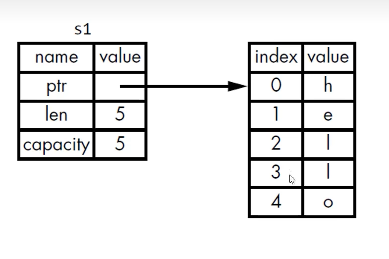
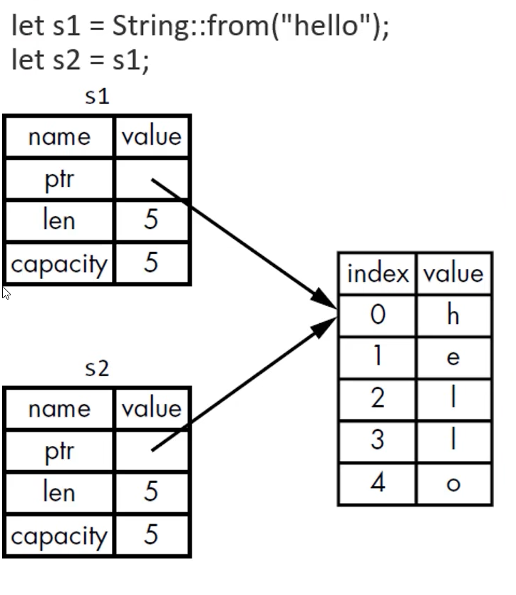

# 所有权 ownership
所有权是rust最独特的特性，可以让rust无需gc(garbage collecter)就能保证内存安全。
### Stack vs Heap
Stack 和 Heap 都是可用的内存，但是结构差别很大

## 所有权规则
* 每个值都有一个变量，这个变量是这个值改的所有者
* 每个值同时只能有一个所有者
* 当所有者离开作用域(scope), 这个值就会被删除。

## 变量作用域
Scope 就是程序中一个项目的范围

## String 类型
* String 比那些基础类型更复杂，因为它是一个复合类型
* 字符串字面值：不可变，硬编码到程序中

我们可以使用from函数从字符串字面值创建出String 类型
```
let s = String::from("hello");
```
"::" 表示from是String类型下的一个函数

```
let mut s = String::from("Hello");
s.push_str(", world!");
println!("{}", s);
```

## 内存与分配
* 字符串字面值，在编译的时候就知道内容了，其文本内容可以被硬编码到最终的可执行文件中，这也是为什么字符串字面值是快速的原因。（不可变性）
* String 类型，为了支持其可变性，需要在heap上分配内存来保存编译文本时的未知的文本内容：
    * 操作系统必须在运行时来请求内存
        * 这步通过调用 String::from 完成
    * 当用完String后，需要使用某种方式将内存返回给操作系统
        * 这步，在拥有GC的语言中，由GC完成
        * 没有GC，就需要我们去识别何时不再需要这些内存并调用代码来释放它。
            * 如果忘了，那就浪费内存
            * 如果过早释放，变量就会非法
            * 如果重复释放，也会非法
Rust 采用了不同的方式；对于某个值来说，当拥有它的变量走出作用范围时，内存会立即自动地交还给操作系统。
这里是自动调用了drop函数。
## 变量与数据交互的方式：移动(Move)
多个变量可以与同一个数据使用一种独特的方式来交互
```
let x =5;
let y = x;
```
整数是已知固定大小件简单的值，这两个5被压到了stack中

string类型，是一个三部分的值：指向存储在heap中的内容的指针，长度，容量



```
let s1 = String::from("Hello");
let s2 = s1;
```
当把s1赋给s2，String 的数据被复制了一份；
* 在stack上复制了一份指针，长度，容量
* 并没有复制指针指向的heap上的数据




