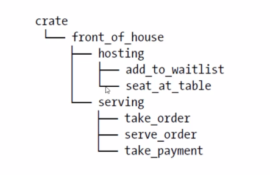

# Rust 的代码组织
* 代码组织主要包括：
    * 哪些细节可以暴露， 哪些细节是私有的
    * 作用域内哪些名称有效

* 模块系统:
    * Package(包): Cargo 的特性, 让你构建, 测试, 共享crate
    * Crate (单元包): 一个模块树, 它可以产生一个library或可执行文件
    * Module (模块) 和 use: 让你控制作用域和路径的私有性
    * Path (路径): 一个命名项的方式, 例如: struct, function, module  
    
## Package 和 Crate
* Crate 的类型:
    * binary: 一个可执行文件
    * library: 一个库
* Crate Root: 
    * 是源代码文件
    * Rust 编译器从这里开始, 组成你的Crate 的根moudle
* 一个Package:
    * 包含一个 Cargo.toml 文件, 它描述了如何构建这些 Crates
    * 只能包含0-1个library crate
    * 可以包含任意数量的 binary crate
    * 但必须至少包含一个crate (无论是library还是binary)

### Cargo 惯例:
* src/main.rs :
    * 是 binary crate 的 crate root
    * crate 名与package名相同

* src/lib.rs:
    * package 包含一个library crate
    * library crate 的 crate root
    * crate 名与package名相同

* Cargo 把crate root 文件交给rustc 来构建library 或binary

* 一个Package 可以有多个 binary crate:
    * 文件放在src/bin 目录下
    * 每个文件是单独的binary crate

### Crate 的作用
* 将相关功能组合到一个作用域内, 便于在项目之间共享
    * 防止冲突
* 例如 rand crate,  访问它的功能需要通过它的名字: rand

### 定义moudle 来控制作用域和实用性
* Moudle
    * 在一个crate内, 将代码进行分组
    * 增加可读性, 易于复用
    * 控制项目(item) 的私有性。 public/private
* 建立module:
    * mod 关键字
    * 可嵌套
    * 可包含其他项(struct, enum, 常量, trait, 函数等)的定义
    * 默认是私有的 可加`pub`关键字使其公有  
在src/lib.rs 中定义一个模块:

```
mod front_of_house {
    // path: src/lib.rs
    // 子moudle
    mod hosting {
    fn add_to_waitlist() {}
    }
    // 子moudle
    mod serving {
    fn take_order() {}
    fn serve_order() {}
    fn take_payment() {}
    }
}
```
结构:  



* src/main.rs 和 src/lib.rs 叫做crate roots:
    * 这两个文件(任意一个)的内容形成了名为crate的模块, 位于整个模块树的根部

## 路径 (Path)
* 为了在rust的模块中找到某个条目,需要使用路径
* 路径的两种形式:
    * 绝对路径: 从crate root 开始, 使用crate名或者字面值`crate`
    * 相对路径: 从当前模块开始, 使用`self`, `super` 或当前模块的标识符
* 路径至少由一个标识符组成,标识符之间使用`::`
* 例如: `crate::front_of_house::hosting::add_to_waitlist`

