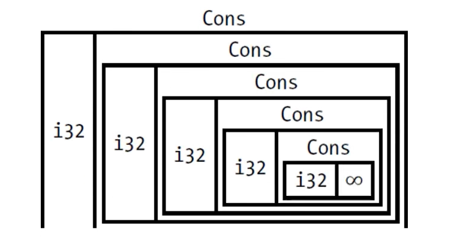
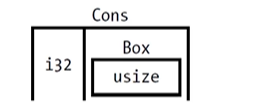

# 智能指针
* 指针: 一个变量在内存中包含的是一个地址(指向其他数据)
* Rust 中最常见的指针就是"引用"
* 引用
    * 使用 `&`
    * 借用它指向的值
    * 没有其它开销
    * 最常见的指针类型

## 智能指针
* 智能指针是这样一些数据结构:
    * 行为和指针相似
    * 有额外的元数据和功能

### 引用计数(Reference Counting) 智能指针类型
* 通过记录所有者的数量, 使一份数据被多个所有者同时持有
* 并在没有任何所有者时自动清理数据

### 引用和智能指针的其他不同
* 引用:         只借用数据
* 智能指针:     很多时候都拥有它所指向的数据

### 智能指针的例子
* `String` 和 `Vec<T>`
* 都拥有一片内存区域, 且允许用户对其操作
* 还拥有元数据(例如容量等)
* 提供额外的功能或保障(String 保障其数据是合法的 UTF-8 编码)

### 智能指针的实现
* 智能指针通常使用struct实现, 并且实现了: 
    * `Deref` 和 `Drop` trait
* Deref trait: 允许智能指针struct 实例像引用一样被使用
* Drop trait: 允许我们自定义当智能指针实例离开作用域时运行的代码

## 本章内容
* 介绍标准库中常见的智能指针
    * `Box<T>`: 在heap内存上分配值
    * `Rc<T>`: 启用多重所有权的引用计数类型
    * `Ref<T>` 和 `RefMut<T>`: 通过 `RefCell<T>` 访问: 在运行时而不是在编译时强制借用规则的类型

* 此外:
    * 内部可变模式(Interior mutability pattern): 不可变类型暴露出可修改其内部值的API
    * 引用循环(Reference cycles): 它们如何泄漏内存, 以及如何防止其发生

## 使用 `Box<T>` 来指向heap上的数据
### `Box<T>`
* `Box<T>` 是最简单的智能指针: 
    * 允许你在heap上存储数据(而不是stack)
    * stack 上是指向heap上数据的指针
    * 没有性能开销
    * 没有其它额外功能

    * 实现了 `Deref` trait 和 `Drop` trait

### `Box<T>` 的常用场景
* 在编译时, 其类型的大小无法确定。但使用该类型时, 上下文却需要知道它确切大小
* 当你有大量数据, 想移交所有权, 但需要确保在操作时数据不会被复制
* 使用某个值时, 你只关心它是否实现了特定的trait, 而不关心它的具体类型

### `Box<T>` 在heap上存储数据
```
fn main() {
    let b = Box::new(5);
    println!("b = {}",b);
}

```
当离开作用域后,存在stack上的指针和heap上的数据都会被清理  

### 使用Box赋能递归类型
* 在编译时, Rust 需要知道一个类型所占的空间大小
* 而递归类型的大小无法在编译的时候被确定  

  

* Rust 无法确定一个递归类型的大小
* 但是Box 类型的大小确定
* 在递归类型中使用Box, 就可以解决上述问题
* 函数式语言中的Cons List

### 关于Cons List
* Cons List 是来自Lisp语言的一种数据结构
* Cons List 里的每个成员由两个元素组成
    * 当前项的值
    * 下一个元素

* Cons List 里的最后一个元素只包含一个Nil 值, 没有下一个元素
    * Nil 表示终止标记
    * Null 表示无效或者缺失的值

### Cons List 并不是Rust的常用集合
* Rust 中的`Vec<T>` 是更常用的集合类型
* 构建一个Cons List
```
use crate::List::{Cons, Nil};

fn main() {
    let list = Cons(1, Cons(2, Cons(3, Nil)));

}
enum List{
    Cons (i32, List),
    Nil,
}
```
报错: `` recursive type `List` has infinite size``


* Rust 无法计算出存储一个List 所需的空间大小
* 不是直接存储数据, 而是存储指向数据的指针, 例如 `Box<T>`


### 使用`Box<T>` 来获得确定大小的递归类型
* `Box<T>` 是一个指针, Rust 知道它需要多少空间, 因为:
    * 存储的是一个地址, 指针的大小不会基于它所指向的数据的大小而改变

" width="250">  

* `Box<T>`:
    * 只提供了"间接"存储和heap内存分配的功能
    * 没有其它额外功能
    * 没有性能开销
    * 适用于需要"间接"存储的场景, 例如Cons List
    * 实现了 `Deref` trait 和 `Drop` trait  


```
use crate::List::{Cons, Nil};

fn main() {
    let list = Cons(1,
        Box::new(Cons(2, 
            Box:: new(Cons(3,
                Box:: new(Nil))))));
}

enum List{
    Cons (i32, Box<List>),
    Nil,
}
```

## Deref Trait


